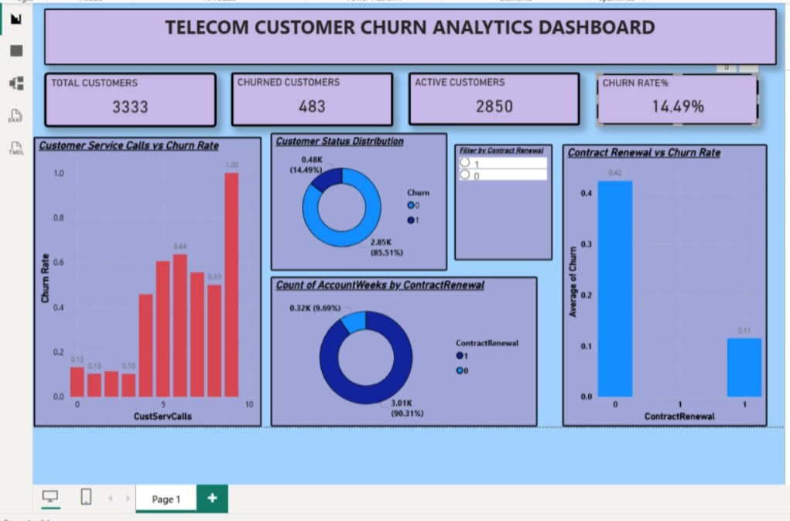

# Telecom Customer Churn Analytics Dashboard

## Overview
Built an end-to-end Telecom Customer Churn Analytics Dashboard using SQL, Power BI and DAX.

## Dataset
- 3,333 customer records
- Customer service interactions
- Contract renewals
- Monthly charges
- Customer churn status

## Key Insights
- Churn Rate: 14.49%
- Higher customer service calls are associated with higher churn.
- Contract renewal significantly reduces churn risk.

## Tools Used
- SQL (MySQL)
- Power BI
- DAX
- Excel

## Dashboard Preview

